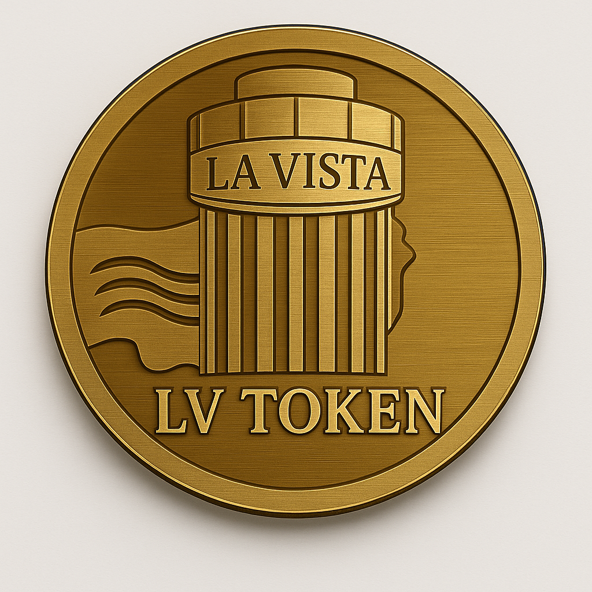

# La Vista Token (LV)

**Version 1.0 — ERC-20 Standard — Solidity ^0.8.20**

**Official ERC-20 Token for Exclusive Payments in Punta del Este, Uruguay.**  
LV is the utility token accepted at the iconic rotating restaurant *La Vista 360°*, the Art Gallery in *El Torreón*, and the *Hotel Concorde*.  
It is built on the Ethereum blockchain and tradable on Uniswap.

---

## 📄 Whitepaper

Access the full whitepaper here:  
📄 [LV Whitepaper on IPFS (Pinata)](https://gateway.pinata.cloud/ipfs/bafybeiabdclcthepoew34xbvm7egbh46ew2fe3vixm72bjlrqplpiahamu)

---

## 🗺️ Roadmap

### **Phase 1 – Launch (✅ Completed)**  
- Token creation and deployment on Ethereum  
- Smart contract verified on Etherscan  
- Website launched: [lavistalv.com](https://lavistalv.com)

### **Phase 2 – Community & Infrastructure (🛠 In Progress)**  
- Whitepaper publication  
- Social media presence: Instagram & X  
- Gallery art integration for real-world token usage  
- Community engagement and first partnerships

### **Phase 3 – Adoption & Expansion (📍 Upcoming)**  
- Full token integration for dinners and lodging  
- NFT development for certified physical artwork  
- Listings on CoinGecko & CoinMarketCap  
- Additional DEX liquidity pools

---

## 🛍️ Real-World Utility

LV Token can be used to pay for:

- 🖼️ Art purchases at the *La Vista* gallery  
- 🍽️ Fine dining at *La Vista 360°* rotating restaurant  
- 🏨 Hotel stays and apartment rentals at *El Torreón* or *Hotel Concorde*  
- 💎 Future possibilities: digital art, NFT-certified ownership, tourism perks

---

## 🌍 Community & Vision

LV is not a meme coin, nor a speculative pump-and-dump.  
It is a **cultural currency** tied to tangible experiences. We believe in:

- 🧠 Value through art and real-world purpose  
- ❤️ Selective, committed community  
- 🤝 Responsible use for meaningful exchange  

---

## 🔗 Official Links

- 🌐 Website: [https://lavistalv.com](https://lavistalv.com)  
- 🔍 Etherscan: [Smart Contract](https://etherscan.io/token/0xb655bfe072fEA5431f801f898fadef23cA004a)  
- 🐦 Twitter (X): [@LaVistaLVToken](https://x.com/lavistalvtoken)  
- 📸 Instagram: [@lavistalvtoken](https://instagram.com/lavistalvtoken)  
- ✉️ Email: info@lavistalv.com  
- 📄 [Smart Contract Source Code](./contracts/LaVistaToken.sol)

---

## 📜 License

This project is licensed under the MIT License. See the [`LICENSE`](LICENSE) for details.
