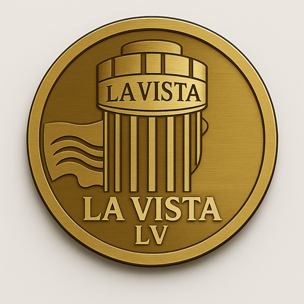

# La Vista LV (LV)

  

**La Vista LV** is the official ERC-20 token linked to the **La Vista 360°** ecosystem in Punta del Este, Uruguay.  
Its purpose is to enable digital payments across **hospitality, gastronomy, and art**, connecting real-world experiences with blockchain technology.

---

## 🔑 Key Features
- ✅ ERC-20 token on Ethereum.  
- ✅ Focused on **art, hospitality, and gastronomy**.  
- ✅ Backed by the **La Vista 360° Punta del Este** brand.  
- ✅ Expanding ecosystem with future integration in venues and experiences.  

---

## 🖼️ Visual Assets
The official logo package is available in multiple formats:

- PNG: 64, 128, 256, 512, 1024, 2048, 3000 px  
- Favicon `.ico` for web usage  
- (Optional) SVG vector version  

👉 All assets are located in the [lv_logo_pack](./lv_logo_pack) folder.

---

## 🌐 Official Links
- 🌎 Website: [lavistalv.com](https://lavistalv.com)  
- 📊 Etherscan: [LV Contract on Ethereum](https://etherscan.io/token/0xbc6550bef072fEA5413f801f898fadef23cA004a)  
- 💧 Uniswap Pool: [Trade LV on Uniswap](https://app.uniswap.org/#/tokens/ethereum/0xbc6550bef072fEA5413f801f898fadef23cA004a)  
- 🐦 Twitter/X: [@LaVistaLVtoken](https://x.com/LaVistaLVtoken)  
- 📸 Instagram: [@lavistalvtoken](https://instagram.com/lavistalvtoken)  

---

## 📜 License
This repository and its assets are licensed under the **MIT License**.
